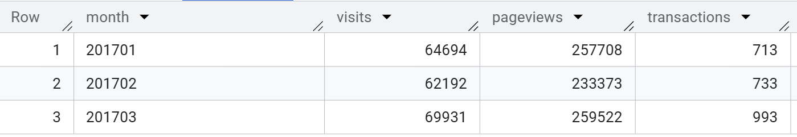
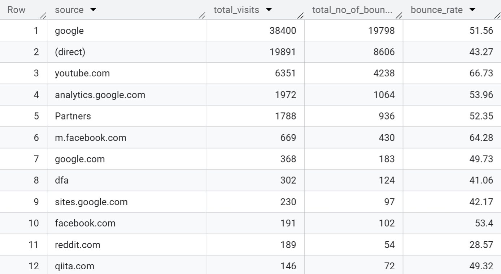
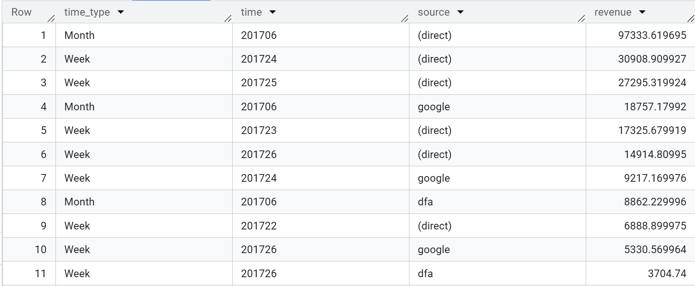
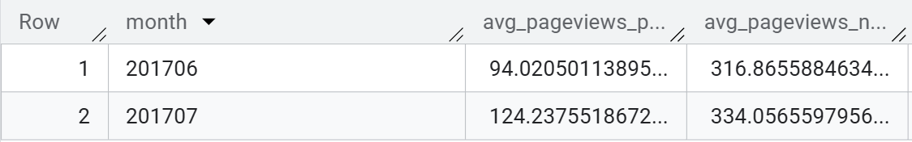
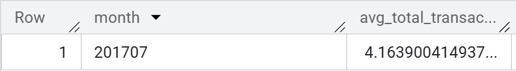
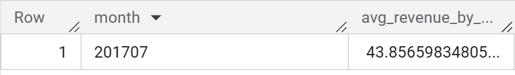
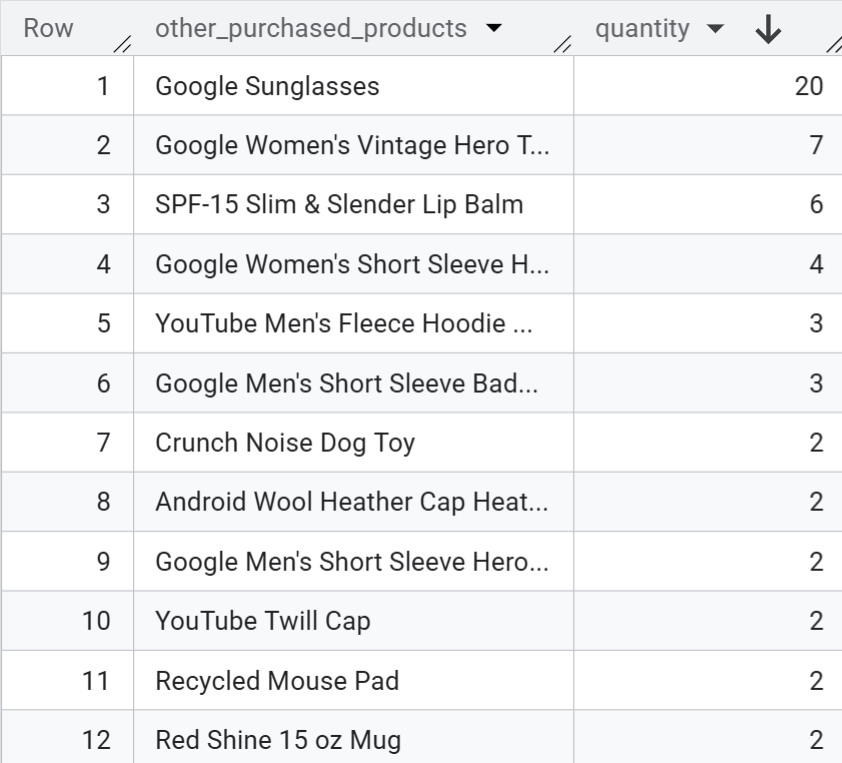
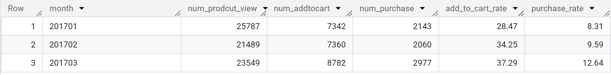

# E-commerce Behavior Analysis with BigQuery


All 8 queries below have been executed and validated directly in Google BigQuery. You can view the live project (queries, execution, and saved results) here:

👉 **[Open in BigQuery Console](https://console.cloud.google.com/bigquery?project=uni-sql-project-1&authuser=1&ws=!1m15!1m7!12m5!1m3!1sgolden-shine-472610-g7!2sus-central1!3s8401e328-64f2-4126-8ffb-c8957fd87998!2e1!23sRECENT_RESOURCES!1m6!12m5!1m3!1suni-sql-project-1!2sus-central1!3s52278554-753e-4a60-bf9e-de9c63bb4ddd!2e1)**

---

## 📁 Project Overview

| | |
|---|---|
| **Dataset** | [`bigquery-public-data.google_analytics_sample.ga_sessions_2017`](https://console.cloud.google.com/marketplace/product/obfuscated-ga360-data/google-analytics-sample) — real (obfuscated) Google Analytics data from the Google Merchandise Store |
| **Tool** | Google BigQuery (Standard SQL) |
| **Time period analyzed** | January – July 2017 |
| **Focus areas** | Traffic trends, marketing channel performance, revenue attribution, purchaser behavior, cross-sell, conversion funnel |
| **Techniques used** | `UNNEST` on nested/repeated fields, CTEs (`WITH`), window-free aggregation, `_TABLE_SUFFIX` wildcard tables, `FORMAT_DATE`/`PARSE_DATE`, conditional aggregation (`COUNTIF`), self-joins via CTE, `UNION ALL` |

### Why this dataset?

The GA sample dataset stores each **session** as a row, with **hits** (page views, events, e-commerce actions) and **products** nested inside each hit as repeated `RECORD` fields. This mirrors how real analytics/event data is structured in production data warehouses — making it a realistic exercise in writing SQL against **semi-structured, nested data**, not just flat tables.

---

## 🎯 Business Questions & Key Findings

### Query 01 — Monthly Traffic & Conversion Overview (Jan–Mar 2017)

**Query:**
```sql
SELECT
  FORMAT_DATE('%Y%m', PARSE_DATE('%Y%m%d', date)) as month, -- convert "date" field from string to date and then format as YYYYMM
  SUM(totals.visits) as visits,
  SUM(totals.pageviews) as pageviews,
  SUM(totals.transactions) as transactions
FROM `bigquery-public-data.google_analytics_sample.ga_sessions_2017*`
WHERE _table_suffix BETWEEN '0101' AND '0331' -- extract data for Jan, Feb and March 2017
GROUP BY month
ORDER BY month;
```

**Result:**



---

### Query 02 — Bounce Rate by Traffic Source (July 2017)

**Query:**
```sql
SELECT trafficSource.`source`
      ,SUM(totals.visits) as total_visits
      ,SUM(totals.bounces) as bounces
      ,ROUND(100 * SUM(totals.bounces) / SUM(totals.visits), 2) as bounce_rate
FROM `bigquery-public-data.google_analytics_sample.ga_sessions_201707*`
GROUP BY trafficSource.`source`
ORDER BY total_visits DESC;
```

**Result:**



---

### Query 03 — Revenue by Traffic Source, Weekly & Monthly (June 2017)

**Query:**
```sql
WITH week_out AS
      (SELECT 'week' as time_type
            ,FORMAT_DATE('%Y%W', PARSE_DATE('%Y%m%d', date)) as week
            ,trafficSource.`source`
            ,SUM(product.productRevenue) / 1000000 as revenue
      FROM `bigquery-public-data.google_analytics_sample.ga_sessions_201706*`,
      UNNEST(hits) hits,
      UNNEST(hits.product) product
      GROUP BY week, trafficSource.`source`)

SELECT *
FROM
      (SELECT 'month' as time_type
            ,'201706' as time
            ,source
            ,SUM(revenue) as revenue
      FROM week_out
      GROUP BY 3
      ORDER BY 4 DESC) as month_out
UNION ALL
SELECT *
FROM week_out
ORDER BY revenue DESC;
```

**Result:**



---

### Query 04 — Pageviews: Purchasers vs. Non-Purchasers (Jun–Jul 2017)

**Query:**
```sql
WITH purchase AS
      (SELECT FORMAT_DATE('%Y%m', PARSE_DATE('%Y%m%d', date)) as month
            ,SUM(totals.pageviews) / COUNT(DISTINCT fullVisitorId) as avg_pageviews_purchase
      FROM `bigquery-public-data.google_analytics_sample.ga_sessions_2017*`,
      UNNEST(hits) hits,
      UNNEST(hits.product) product
      WHERE _table_suffix BETWEEN '0601' AND '0731'
            AND totals.transactions >= 1
            AND product.productRevenue IS NOT NULL
      GROUP BY month),

non_purchase AS
      (SELECT FORMAT_DATE('%Y%m', PARSE_DATE('%Y%m%d', date)) as month
            ,SUM(totals.pageviews) / COUNT(DISTINCT fullVisitorId) as avg_pageviews_non_purchase
      FROM `bigquery-public-data.google_analytics_sample.ga_sessions_2017*`,
      UNNEST(hits) hits,
      UNNEST(hits.product) product
      WHERE _table_suffix BETWEEN '0601' AND '0731'
            AND totals.transactions IS NULL
            AND product.productRevenue IS NULL
      GROUP BY month)

SELECT *
FROM purchase
INNER JOIN non_purchase USING (month);
```

**Result:**



---

### Query 05 — Avg. Transactions per Purchasing User (July 2017)

**Query:**
```sql
SELECT '201707' as month
      ,SUM(totals.transactions) / COUNT(DISTINCT fullVisitorId) as avg_transactions_per_user
FROM `bigquery-public-data.google_analytics_sample.ga_sessions_201707*`,
UNNEST(hits) hits,
UNNEST(hits.product) product
WHERE totals.transactions >= 1
      AND product.productRevenue IS NOT NULL;
```

**Result:**



---

### Query 06 — Avg. Revenue per Session, Purchasers Only (July 2017)

**Query:**
```sql
SELECT '201707' as month
      ,ROUND((SUM(product.productRevenue) / SUM(totals.visits)) / 1000000, 2) as avg_revenue_per_visit
FROM `bigquery-public-data.google_analytics_sample.ga_sessions_201707*`,
UNNEST(hits) hits,
UNNEST(hits.product) product
WHERE totals.transactions IS NOT NULL
      AND product.productRevenue IS NOT NULL;
```

**Result:**



---

### Query 07 — Cross-Sell Analysis: "YouTube Men's Vintage Henley" (July 2017)

**Query:**
```sql
WITH customer AS
      (SELECT fullVisitorId
      FROM `bigquery-public-data.google_analytics_sample.ga_sessions_201707*`,
      UNNEST(hits) hits,
      UNNEST(hits.product) product
      WHERE product.v2ProductName = "YouTube Men's Vintage Henley"
            AND product.productRevenue IS NOT NULL
            AND totals.transactions >= 1)

SELECT product.v2ProductName as other_purchased_products
      ,SUM(product.productQuantity) as quantity
FROM `bigquery-public-data.google_analytics_sample.ga_sessions_201707*`,
UNNEST(hits) hits,
UNNEST(hits.product) product
WHERE product.productRevenue IS NOT NULL
      AND totals.transactions >= 1
      AND fullVisitorId IN (SELECT fullVisitorId FROM customer)
      AND product.v2ProductName != "YouTube Men's Vintage Henley"
GROUP BY 1
ORDER BY 2 DESC;
```

**Result:**



---

### Query 08 — Conversion Funnel: View → Add-to-Cart → Purchase (Jan–Mar 2017)

**Query:**
```sql
SELECT *
      ,ROUND(100 * num_addtocart / num_product_view, 2) as add_to_cart_rate
      ,ROUND(100 * num_purchase / num_product_view, 2) as purchase_rate
FROM
  (SELECT FORMAT_DATE('%Y%m', PARSE_DATE('%Y%m%d', date)) as month
        ,COUNTIF(hits.eCommerceAction.action_type = '2') as num_product_view
        ,COUNTIF(hits.eCommerceAction.action_type = '3') as num_addtocart
        ,COUNTIF(hits.eCommerceAction.action_type = '6' AND product.productRevenue IS NOT NULL) as num_purchase
  FROM `bigquery-public-data.google_analytics_sample.ga_sessions_2017*`,
  UNNEST(hits) hits,
  UNNEST(hits.product) product
  WHERE _table_suffix BETWEEN '0101' AND '0331'
  GROUP BY month) as count_out
ORDER BY month;
```

**Result:**



---

## 🧠 Summary of Key Business Insights

1. **March 2017 converted better, not just attracted more traffic.** Transactions rose +35.5% from February to March while visits grew only +12.4%. The funnel confirms this: from January to March, add-to-cart rate climbed from 28.5% to 37.3% and purchase rate from 8.3% to 12.6%. Worth investigating what changed (promotion, seasonality, or traffic mix).
2. **Google drives volume, direct drives revenue.** In June 2017, `(direct)` traffic accounted for roughly 78% of revenue across the top three sources, even though `google` sent a larger share of visits. Traffic volume and revenue contribution are not the same thing.
3. **Engagement varies sharply by channel.** In July 2017, `(direct)` visitors bounced at 43.3%, while `youtube.com` visitors bounced at 66.7%, suggesting low-intent clicks. `reddit.com` had the lowest bounce rate (28.6%) but only 189 visits, making it a possible low-cost channel to test at scale.
4. **Heavy browsing does not mean buying.** In June and July 2017, non-purchasers viewed 2.7–3.4x more pages than purchasers. Decisive buyers appear to navigate directly to what they want, so fast, low-friction paths to checkout may matter more than maximizing content depth.
5. **Buyers come back to buy again.** Purchasing users averaged about 4.2 transactions in July 2017, so retention and remarketing to existing customers matter as much as acquisition.
6. **Clear cross-sell opportunity.** Google Sunglasses was the most common co-purchase with the YouTube Men's Vintage Henley, with 20 units sold, nearly 3x the next product. This makes it a concrete bundling candidate at checkout or on the product page.

